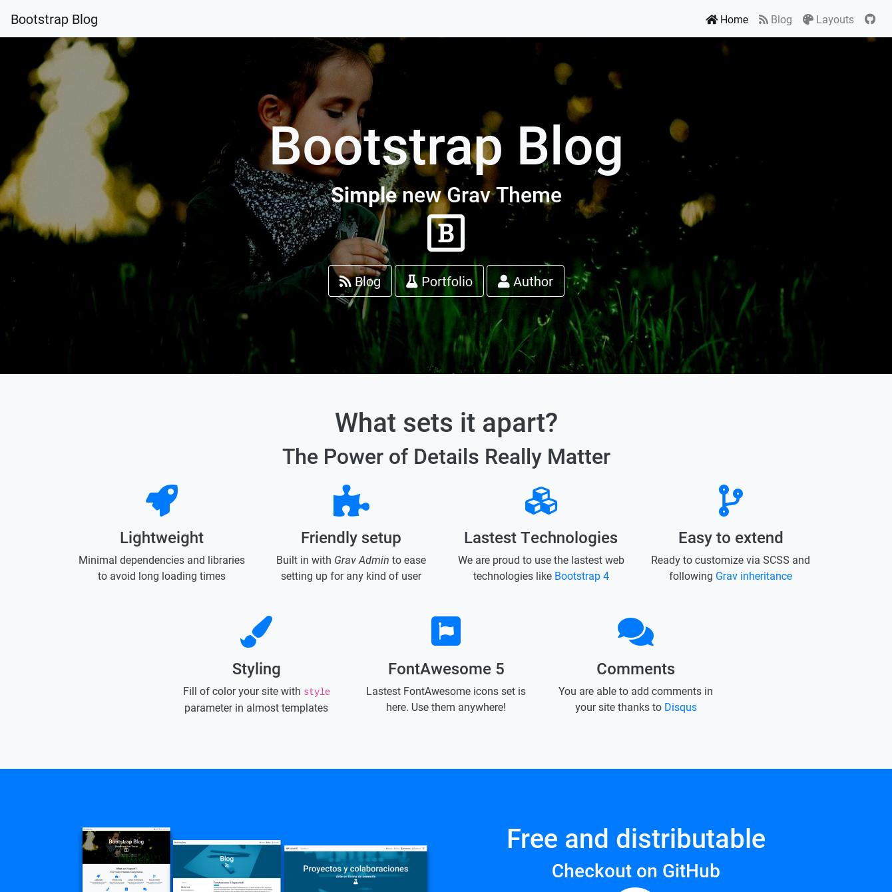

# Bootstrap Blog

**Bootstrap Blog** is a theme for [Grav CMS](http://github.com/getgrav/grav) built in [Bootstrap v4.3](https://getbootstrap.com/docs/) framework and provides a powerful base to develope your own theme using SCSS. Also included latest [FontAwesome 5](https://fontawesome.com/).

## Features

* Lightweight and minimal for optimal performance
* Bootstrap 4.3
* SCSS based CSS source files to ease theme customization
* 3 Blog collection Layouts
* Twitter Timeline Sidebar Widget
* Fill of color your site with more than 25 defined styled colors
* Fontawesome 5
* Disquss comments

### Page Templates

* Default template `default.md`
* Error template `error.md`
* Blog collection template `blog.md`
* Blog item template `item.md`
* Modular templates: `modular.md`
  * Features Modular template `features.md`
  * Showcase Modular template `showcase.md`
  * Blog Modular template `blog.md`
  * Text Modular template `text.md`
  * Carousel Modular template `carousel.md`
  * Bars Modular template `bars.md`

# Installation

Installing the Bootstrap Blog theme can be done in one of two ways. GPM (Grav Package Manager) installation method enables you to quickly and easily install the theme with a simple terminal command, while the manual method enables you to do so via a zip file.

## GPM Installation (Preferred)

The simplest way to install this theme is via the [Grav Package Manager (GPM)](http://learn.getgrav.org/advanced/grav-gpm) through your system's Terminal (also called the command line). From the root of your Grav install type:

    bin/gpm install bootstrap-blog

This will install the Bootstrap Blog theme into your `/user/themes` directory within Grav. Its files can be found under `/your/site/grav/user/themes/bootstrap-blog`.

## Manual Installation

To install this theme, just download the zip version of this repository and unzip it under `/your/site/grav/user/themes`. Then, rename the folder to `bootstrap-blog`. You can find these files either on [GitHub](https://github.com/ayozehd/bootstrap-blog) or via [GetGrav.org](https://getgrav.org/downloads/themes).

You should now have all the theme files under

    /your/site/grav/user/themes/bootstrap-blog

You can copy the `user/themes/bootstrap-blog/bootstrap-blog.yaml` file to `user/config/themes/` folder and modify, or you can use the admin plugin.

> NOTE: Do not modify the `user/themes/bootstrap-blog/bootstrap-blog.yaml` file directly or your changes will be lost with any updates

## Documentation

Demo and theme documentation availables [here](https://bootstrap-blog.ayozehd.com).

## Credits

Thanks to [Paul Hibbits](https://hibbittsdesign.org) and [Grav Team](https://getgrav.com/) for inspire me.

